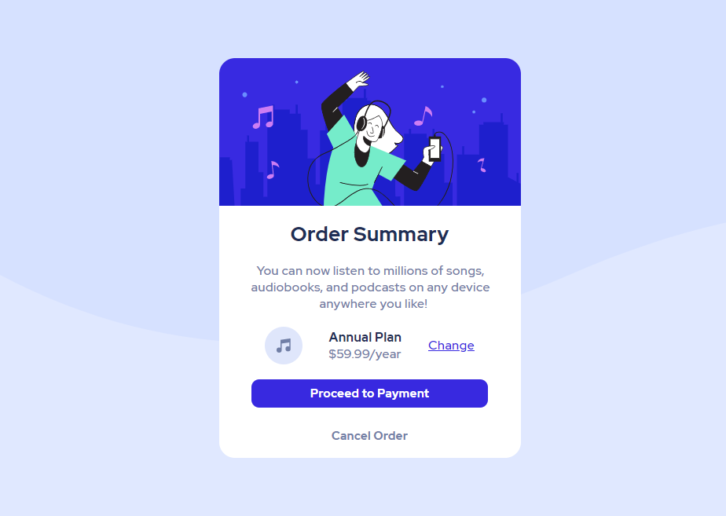
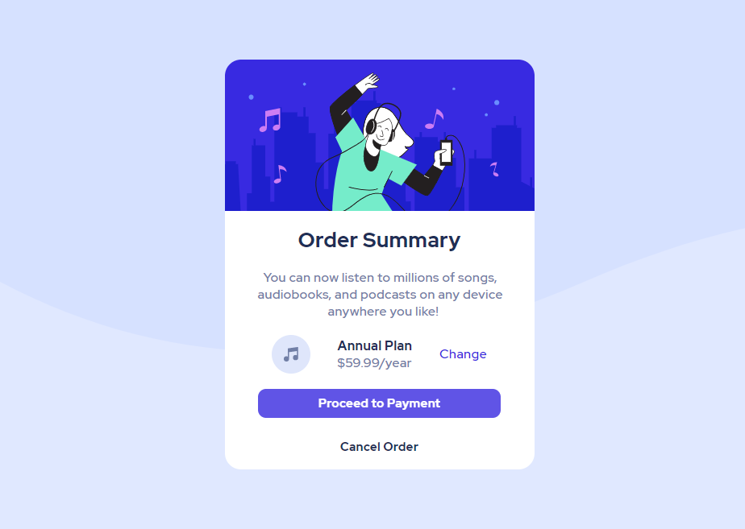

# Frontend Mentor - Order summary card solution

This is a solution to the [Order summary card challenge on Frontend Mentor](https://www.frontendmentor.io/challenges/order-summary-component-QlPmajDUj). Frontend Mentor challenges help you improve your coding skills by building realistic projects.

## Table of contents

- [Overview](#overview)
  - [The challenge](#the-challenge)
  - [Screenshot](#screenshot)
  - [Links](#links)
  - [Built with](#built-with)
- [Author](#author)

### The challenge

Users should be able to:

- See active states for interactive elements

## Overview

### Screenshot
Desktop design\

Desktop active state\

Mobile design \

Mobile active state\

### Links

- Solution URL: 
- Live Site URL: 

### Built with

- Semantic HTML5 markup
- Flexbox
- Mobile-first workflow

## Author

- Frontend Mentor - [@ounissi-zakaria](https://www.frontendmentor.io/profile/ounissi-zakaria)
